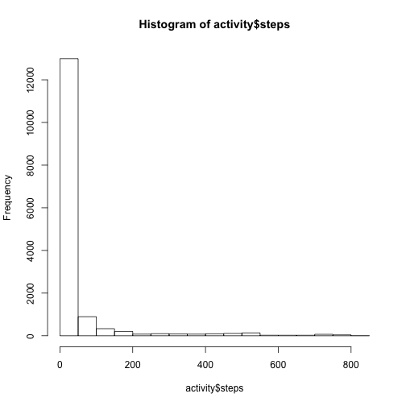

# Reproducible Research: Peer Assessment 1


## Loading and preprocessing the data

```r
raw = as.data.frame ( read.csv (unz("activity.zip", "activity.csv")) )

activity = subset(raw,!is.na(raw$steps))

head(activity)
```

```
##     steps       date interval
## 289     0 2012-10-02        0
## 290     0 2012-10-02        5
## 291     0 2012-10-02       10
## 292     0 2012-10-02       15
## 293     0 2012-10-02       20
## 294     0 2012-10-02       25
```

```r
unlink("activity.csv")
```

## What is mean total number of steps taken per day?


```r
mean(activity$steps)
```

```
## [1] 37.38
```

```r
median(activity$steps)
```

```
## [1] 0
```

```r
hist(activity$steps)
```

 

## What is the average daily activity pattern?


```r
ag = aggregate(steps ~ interval, data=activity, FUN=mean)
plot (ag, type="l")
```

 

```r
index_of_max = which.max(ag$steps)
```

The ``835``-th 5-minute interval, on average across all the days in the dataset, contains the maximum number of steps - ``206.1698``.

## Imputing missing values

```r
missing = subset(raw,is.na(raw$steps))
n = nrow(missing)
```

The number of missing values of steps is ``2304``.

Now replacing the missing values with the mean values of particular time interval.


```r
newActivity = raw
for (i in 1:nrow(raw)) {
  row = raw[i,]
  if (is.na(row$steps)) {
    interval = row$interval
    idx = which (ag$interval==interval)
    newActivity$steps[i] = ag$steps[idx]    
  }
}
head(newActivity)
```

```
##     steps       date interval
## 1 1.71698 2012-10-01        0
## 2 0.33962 2012-10-01        5
## 3 0.13208 2012-10-01       10
## 4 0.15094 2012-10-01       15
## 5 0.07547 2012-10-01       20
## 6 2.09434 2012-10-01       25
```

```r
mean(newActivity$steps)
```

```
## [1] 37.38
```

```r
median(newActivity$steps)
```

```
## [1] 0
```

```r
hist(newActivity$steps)
```

 

## Are there differences in activity patterns between weekdays and weekends?

Note: The following analysis is based on the data with imputed missing values.


```r
w = cbind(newActivity, weekdays(strptime(newActivity$date, "%Y-%m-%d")))
colnames(w)[4] <- "Day"
weekdays = subset (w, !(Day %in% list("Sunday", "Saturday")))
weekends = subset (w, Day %in% list("Sunday", "Saturday"))

agWeekdays = aggregate(steps ~ interval, data=weekdays, FUN=mean)
agWeekends = aggregate(steps ~ interval, data=weekends, FUN=mean)
par(mfrow=c(2,1)) # 2 plots in 1 column   
par(xpd=TRUE)
plot (agWeekdays$steps, type="l", main="Weekdays", ylab="Avg. number of steps", xlab="5-minute interval")
plot (agWeekends$steps, type="l", main="Weekends", ylab="Avg. number of steps", xlab="5-minute interval")
```

 
